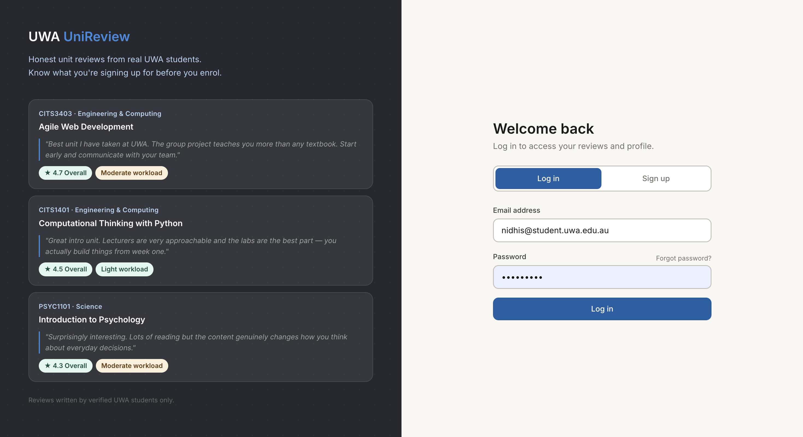
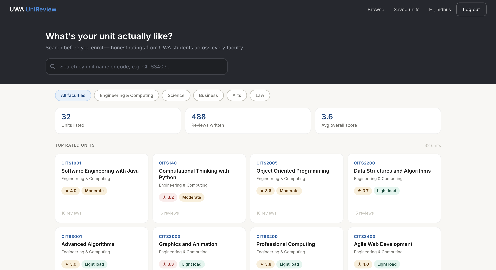
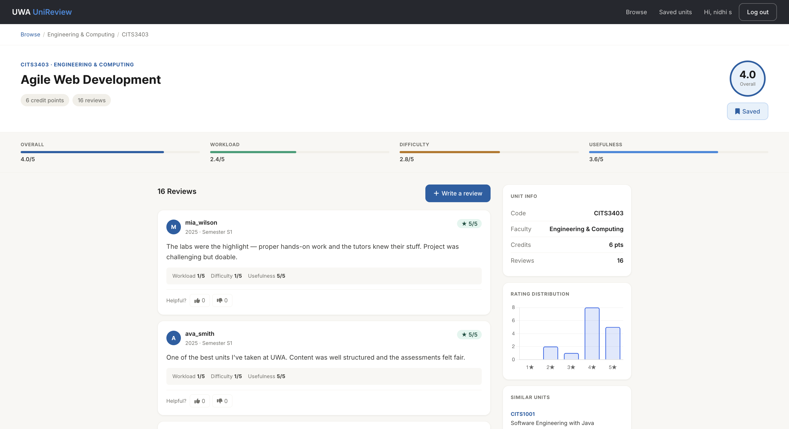

# UWA UniReview

A student-driven web application where UWA students can see and share honest reviews of units before enrolling. Browse units across all faculties, read peer reviews of workload, difficulty and usefulness, save units for later, vote on helpful reviews, and contribute your own experiences to help fellow students make informed choices.

---

## Screenshots

### Login page
A welcome landing page experience with unit review previews as social proof.



### Dashboard
Search and filter UWA units by faculty, with rating and workload signals at a glance.



### Unit detail
Multi-dimensional aggregated ratings, distribution chart, similar units browsing, and reviews from verified students.



---

## Team

| UWA ID | Full Name | GitHub Username | Role |
|----------|------------|-----------------|---------------------|
| 24667496 | Nidhi Sorathiya | [@nisorathiya](https://github.com/nisorathiya) | Project Lead / Documentation / Full-stack developer |
| 24500079 | Nevis Herlangga | [@nxherl](https://github.com/nxherl) | Documentation & Wireframing / Full-stack developer |
| 24726135 | Md Mahabub Islam | [@ProgMahabub21](https://github.com/ProgMahabub21) | Full-stack developer |
| 25167515 | Xingyan Guo | [@laomeile](https://github.com/laomeile) | Full-stack developer |

---

## Purpose and Design

UniReview helps UWA students discover what they are actually signing up for when choosing units. Course handbooks describe the syllabus, but they don't tell you whether the workload is reasonable, whether the lecturer is engaging, or whether the assessment/group project is fair. UniReview fills that gap - students review units they already completed and future students benefit from the collective knowledge.

**Key design principles:**
- **Honest** — reviews are written by verified UWA students using their `@student.uwa.edu.au` email
- **Structured** — every review captures four dimensions (overall, workload, difficulty, usefulness) on a 1–5 scale
- **Discoverable** — fast unit search with live filtering by faculty
- **Community-driven** — users vote helpful reviews up, building a credibility signal

---

## Features

**Authentication and accounts**
- Register with a UWA student email (validated)
- Secure password hashing using werkzeug
- Login / logout with session management via flask-login
- CSRF protection on all forms

**Browsing units**
- Dashboard with 32+ seeded UWA units across 5 faculties
- Live AJAX search by unit code or name
- Faculty filter pills (Engineering & Computing, Science, Business, Law, Arts)
- Aggregated rating displayed on each unit card
- Dynamic site-wide stats (total units, total reviews, average score)

**Unit detail page**
- Hero section with unit info, average overall rating, and save button
- Stats bar showing average across 4 dimensions with progress bars
- Full list of reviews with vote counts and clickable author profiles
- **Rating distribution chart** using Chart.js can help see how reviews are spread across 1–5 stars
- Sidebar with unit info and similar units

**Reviews**
- Submit a review with rating sliders and a written comment (min 20 chars)
- One review per user per unit (enforced both client and server-side)
- Edit or delete your own reviews
- Upvote/downvote helpful reviews via AJAX (toggle behaviour)
- Cannot vote on your own reviews

**Saved units**
- Bookmark any unit with a single click
- Dedicated `/saved-units` page showing all bookmarked units
- Save state persists across sessions

**Profile pages**
- Public profile at `/profile/<username>`
- Stats summary — reviews written, average rating given, helpful votes received
- Full list of reviews by that user with links to the units
- Email visible only on own profile

**Notifications**
- Reusable toast component for all server-side flash messages and client-side AJAX feedback
- Styled confirmation modal replaces native `confirm()` dialogs for destructive actions
- All HTML5 native popups replaced with styled toasts for a consistent design language

---

## Technology Stack

| Layer | Technology |
|-------|------------|
| Backend framework | Flask 3 |
| Database | SQLite via SQLAlchemy ORM |
| Migrations | Flask-Migrate (Alembic) |
| Authentication | Flask-Login + werkzeug password hashing |
| Forms/CSRF | Flask-WTF + WTForms |
| Templating | Jinja2 |
| Frontend CSS | Custom CSS with design tokens, Bootstrap 5 utility classes |
| Frontend JS | jQuery + AJAX |
| Charts | Chart.js (loaded via CDN, only on unit detail page) |
| Icons | Font Awesome 6 |
| Fonts | Google Fonts (Inter) |

All chosen technologies are within the project brief's allowed list.

---

## Security

- **Passwords stored as salted hashes** using `werkzeug.security.generate_password_hash` (pbkdf2). Plaintext passwords are never stored.
- **CSRF protection** on every form via Flask-WTF, including AJAX requests via the `X-CSRFToken` header.
- **SQL injection prevention** through SQLAlchemy ORM — no raw SQL anywhere in the codebase.
- **XSS protection** via Jinja2's auto-escaping (default).
- **Secret key** read from environment variable in production, with a development fallback in `config.py`.

---

## How to Run the Application

### 1. Clone the repository
```bash
git clone https://github.com/nisorathiya/uwa-unireview.git
cd uwa-unireview
```

### 2. Create and activate a virtual environment
```bash
# macOS / Linux
python3 -m venv venv
source venv/bin/activate

# Windows
python -m venv venv
venv\Scripts\activate
```

### 3. Install dependencies
```bash
pip install -r requirements.txt
```

### 4. Initialise the database
```bash
flask db upgrade
```

This creates `instance/unireview.db` with all required tables.

### 5. Seed the database with 32 UWA units
```bash
python3 seed.py
```

The script is safe to run multiple times — it skips units that already exist.

### 6. Run the server
```bash
python3 run.py
```

Open **http://localhost:5000** in your browser.

## How to Run the Tests

The project has two layers of tests: unit tests that hit Flask directly via
the test client (fast, no browser), and Selenium tests that drive a real
Chrome browser against a live Flask server (slower, more realistic).

### Prerequisites for Selenium tests

Selenium tests require **Google Chrome** installed on your machine.
ChromeDriver is downloaded automatically by `webdriver-manager` on first
run, so no manual driver setup is needed.

### Unit tests (38 tests)

Tests for Flask routes, models, forms, and API endpoints. Runs in under
10 seconds with no browser required.

```bash
pytest tests/ -v --ignore=tests/selenium
```

### Selenium WebDriver tests (8 tests)

End-to-end tests that drive a real Chrome browser against a live Flask
server. Each test resets the database and seeds known fixtures, so tests
are fully isolated and can be run in any order.

```bash
# Run headless (default)
pytest tests/selenium -v

# Run with a visible browser window
HEADLESS=0 pytest tests/selenium -v
```

The Selenium suite covers:

| File | Test | What it covers |
|---|---|---|
| `test_user_flow.py` | `test_register_login_logout_flow` | Full auth journey — register, dashboard redirect, logout, log back in |
| `test_user_flow.py` | `test_login_with_wrong_password_shows_error` | Negative auth — wrong password keeps user on /login with error toast |
| `test_search.py` | `test_search_filters_units_by_keyword` | AJAX search (`/api/search`) with jQuery debounce |
| `test_search.py` | `test_faculty_filter_pill_narrows_results` | Faculty filter pills + AJAX card re-render |
| `test_reviews.py` | `test_logged_in_user_can_submit_review` | Review form (sliders + textarea) submission and rendering |
| `test_reviews.py` | `test_logged_in_user_can_save_unit` | AJAX save-unit toggle and persistence across page reload |
| `test_reviews.py` | `test_user_can_edit_their_own_review` | Edit-review JS pre-fill, form action swap, and updated content rendering |
| `test_reviews.py` | `test_user_can_upvote_another_users_review` | Vote AJAX with live count update and active-state toggle |

### Run all tests at once

```bash
pytest tests/ -v
```

---

## Project Structure

```
uwa-unireview/
├── app/
│   ├── __init__.py              # App factory and extension setup
│   ├── models.py                # MODELS — SQLAlchemy database models
│   ├── routes.py                # CONTROLLERS — HTTP request handlers
│   ├── forms.py                 # WTForms validation classes
│   ├── templates/               # VIEWS — Jinja2 HTML templates
│   └── static/
│       ├── css/                 # Custom CSS with design tokens
│       └── js/                  # jQuery + custom JS (flash, search, unit, etc.)
├── tests/
│   ├── conftest.py              # Shared pytest fixtures (test client, DB)
│   ├── test_auth.py             # Unit tests for auth routes
│   ├── test_reviews.py          # Unit tests for review routes
│   ├── test_api_saves.py        # Unit tests for save-unit API endpoint
│   └── selenium/
│       ├── conftest.py          # Selenium fixtures (live server, driver, DB reset)
│       ├── test_user_flow.py    # Register, login, logout, wrong-password flows
│       ├── test_search.py       # Dashboard search and faculty filter
│       └── test_reviews.py      # Review submission, editing, save-unit, voting
├── migrations/                  # Alembic migration scripts
├── instance/                    # SQLite database (gitignored)
├── docs/
│   ├── DATABASE.md              # Database schema documentation
│   ├── TESTS.md                 # Testing documentation and test case reference
│   ├── UserStories.md           # User stories (planning)
│   ├── wireframes.md            # Wireframe documentation
│   ├── about-uwa-unireview.md   # Project background
│   ├── database-img/            # ER diagram and schema images
│   ├── wireframes-img/          # Wireframe screenshots
│   ├── meeting-minutes/         # Weekly team meeting notes
│   └── screenshots/             # App screenshots used in this README
├── scripts/
│   └── clear_reviews.py         # Dev utility to wipe reviews from DB
├── config.py                    # App configuration (incl. TestConfig)
├── run.py                       # Entry point
├── seed.py                      # Seeds units into the database
├── seed_reviews.py              # Seeds dummy reviews (for development/testing)
├── requirements.txt             # Python dependencies
└── README.md                    # This file
```

---

## Database

Five tables managed via SQLAlchemy:

- **users** — registered student accounts
- **units** — UWA units (seeded from `seed.py`)
- **reviews** — student reviews of units
- **votes** — upvote/downvote on reviews
- **saved_units** — bookmarked units per user

For full schema details and ER diagram, see [`docs/DATABASE.md`](docs/DATABASE.md).

---

## Notes for Developers

- Always activate the virtual environment before running the app
- You will see `(venv)` at the start of your terminal line when it is active
- Never commit the `venv/` folder — it is in `.gitignore`
- Never commit the `instance/` folder — the database is local-only
- Run `git pull` before starting work each day to get the latest changes from teammates
- For new database schema changes, run `flask db migrate -m "description"` then `flask db upgrade`

---

## License

Academic project for CITS5505 Agile Web Development at the University of Western Australia.