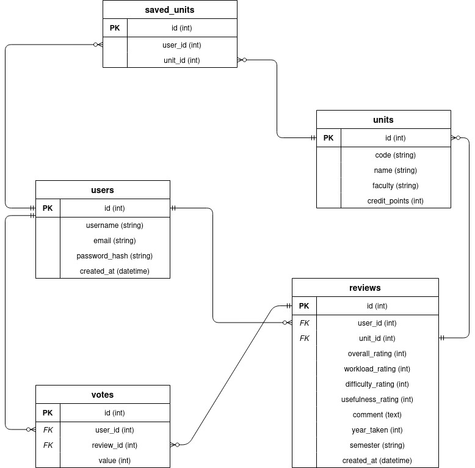

# Database Documentation

## Overview

UniReview uses SQLite as its database engine, managed through SQLAlchemy ORM and Flask-Migrate (Alembic) for schema versioning. The database file is stored at `instance/unireview.db` and is created automatically on first run.

---

## Technology Stack

| Component | Technology |
|-----------|------------|
| Database engine | SQLite 3 |
| ORM | SQLAlchemy (via Flask-SQLAlchemy) |
| Migration tool | Flask-Migrate (Alembic) |
| Configuration | `config.py` → `SQLALCHEMY_DATABASE_URI` |

---

## Schema 



## Tables

### users

Stores registered student accounts.

| Column | Type | Constraints | Description |
|--------|------|-------------|-------------|
| id | Integer | PRIMARY KEY | Auto-incrementing unique identifier |
| username | String(80) | NOT NULL, UNIQUE | Display name chosen at registration |
| email | String(120) | NOT NULL, UNIQUE | Must be a `@student.uwa.edu.au` address |
| password_hash | String(200) | NOT NULL | werkzeug pbkdf2 hash; plain text password is never stored |
| created_at | DateTime | DEFAULT utcnow | Timestamp of account creation |

**Constraints:**
- `unique_username` no two users can share a username
- `unique_email`  no two users can share an email address

**Relationships:**
- One user can write many reviews
- One user can cast many votes
- One user can save many units

---

### units

Stores real UWA units, seeded via `seed.py`.

| Column | Type | Constraints | Description |
|--------|------|-------------|-------------|
| id | Integer | PRIMARY KEY | Auto-incrementing unique identifier |
| code | String(10) | NOT NULL, UNIQUE | Official UWA unit code e.g. `CITS5505` |
| name | String(150) | NOT NULL | Full unit name |
| faculty | String(100) | | Faculty the unit belongs to |
| credit_points | Integer | DEFAULT 6 | Credit point value of the unit |

**Constraints:**
- `code` column has `unique=True` no two units can share a unit code

**Relationships:**
- One unit can have many reviews
- One unit can be saved by many users

---

### reviews

Stores student reviews for units. A user can only review each unit once.

| Column | Type | Constraints | Description |
|--------|------|-------------|-------------|
| id | Integer | PRIMARY KEY | Auto-incrementing unique identifier |
| user_id | Integer | FK → users.id, NOT NULL | The user who wrote the review |
| unit_id | Integer | FK → units.id, NOT NULL | The unit being reviewed |
| overall_rating | Integer | NOT NULL | Overall score 1–5 |
| workload_rating | Integer | NOT NULL | Workload score 1–5 |
| difficulty_rating | Integer | NOT NULL | Difficulty score 1–5 |
| usefulness_rating | Integer | NOT NULL | Usefulness score 1–5 |
| comment | Text | NOT NULL | Written review body |
| year_taken | Integer | | Year the student took the unit |
| semester | String(2) | | Semester taken `S1` or `S2` |
| created_at | DateTime | DEFAULT utcnow | Timestamp of review submission |

**Constraints:**
- `unique_review`  composite unique constraint on `(user_id, unit_id)`. One user can only submit one review per unit.

**Relationships:**
- One review belongs to one user
- One review belongs to one unit
- One review can receive many votes

---

### votes

Stores upvotes and downvotes on reviews. A user can only vote once per review.

| Column | Type | Constraints | Description |
|--------|------|-------------|-------------|
| id | Integer | PRIMARY KEY | Auto-incrementing unique identifier |
| user_id | Integer | FK → users.id, NOT NULL | The user casting the vote |
| review_id | Integer | FK → reviews.id, NOT NULL | The review being voted on |
| value | Integer | NOT NULL | `+1` for upvote, `-1` for downvote |

**Constraints:**
- `unique_vote` composite unique constraint on `(user_id, review_id)`. One user can only vote once per review.

**Relationships:**
- One vote belongs to one user
- One vote belongs to one review

---

### saved_units

Stores bookmarked units per user. A user can only save each unit once.

| Column | Type | Constraints | Description |
|--------|------|-------------|-------------|
| id | Integer | PRIMARY KEY | Auto-incrementing unique identifier |
| user_id | Integer | FK → users.id, NOT NULL | The user who saved the unit |
| unit_id | Integer | FK → units.id, NOT NULL | The unit that was saved |

**Constraints:**
- `unique_saved`  composite unique constraint on `(user_id, unit_id)`. One user cannot save the same unit twice.

**Relationships:**
- One saved_unit record belongs to one user
- One saved_unit record belongs to one unit

---

## Migrations

Database schema changes are managed with Flask-Migrate (Alembic). Migration scripts are stored in `migrations/versions/`.

### Running migrations

```bash
# apply all pending migrations to bring the database up to date
flask db upgrade

# roll back the most recent migration
flask db downgrade
```

### Creating a new migration

After modifying `app/models.py`, generate a new migration script:

```bash
flask db migrate -m "describe what changed"
flask db upgrade
```


---

## Seeding

The database is populated with 32 real UWA units using the seed script:

```bash
python seed.py
```

The script is safe to run multiple times, it checks for existing unit codes before inserting and skips duplicates.

**Faculties covered:**

| Faculty | Units seeded |
|---------|-------------|
| Engineering & Computing | 12 |
| Science | 9 |
| Business | 3 |
| Law | 4 |
| Arts | 4 |

---

## Models

All models are defined in `app/models.py` and inherit from `db.Model` (Flask-SQLAlchemy).

The `Unit` model exposes a `to_dict()` method for JSON serialisation, used by the `/api/search` endpoint:

```python
def to_dict(self):
    return {
        'id':            self.id,
        'code':          self.code,
        'name':          self.name,
        'faculty':       self.faculty,
        'credit_points': self.credit_points,
        'overall':       0,   # placeholder until reviews exist
        'workload':      0,   # placeholder until reviews exist
        'reviews':       0    # placeholder until reviews exist
    }
```

---

## Security Notes

- Passwords are stored as hashes using `werkzeug.security.generate_password_hash`
- The current config.py contains a fallback dev secret key for ease of
local development. The committed file is safe because it falls back
to an environment variable (SECRET_KEY) when one is set, which is
what production deployment would use.