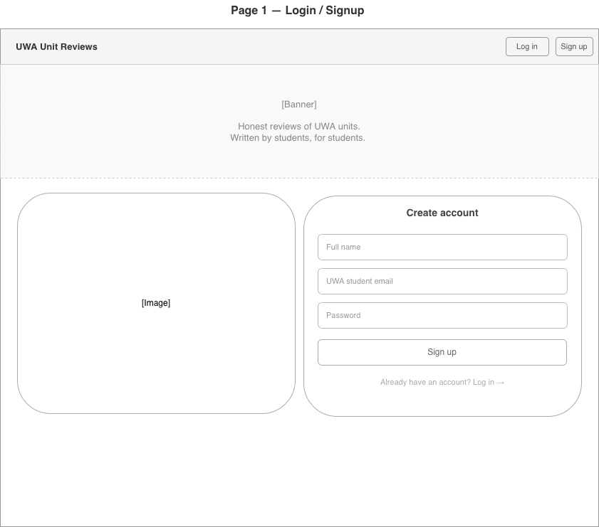
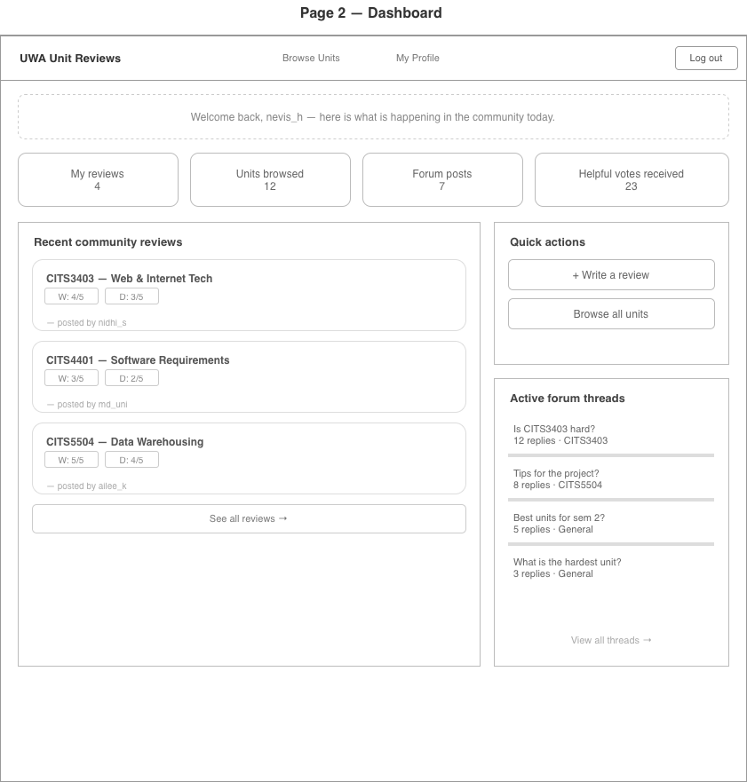
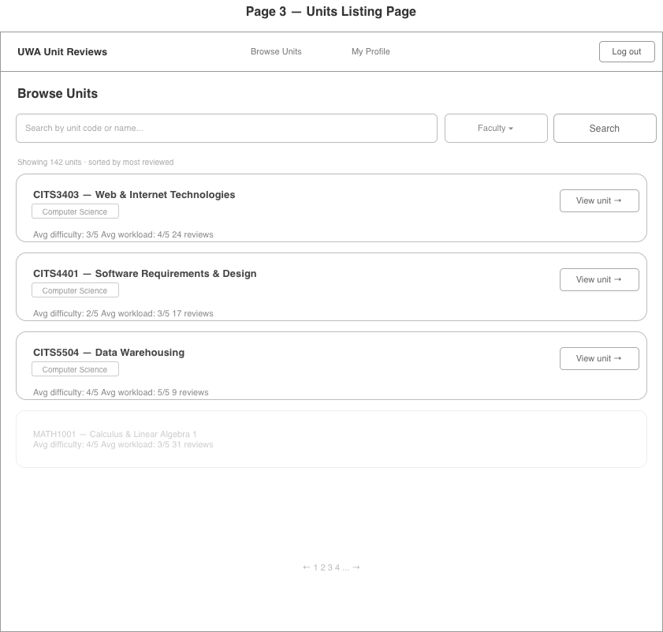
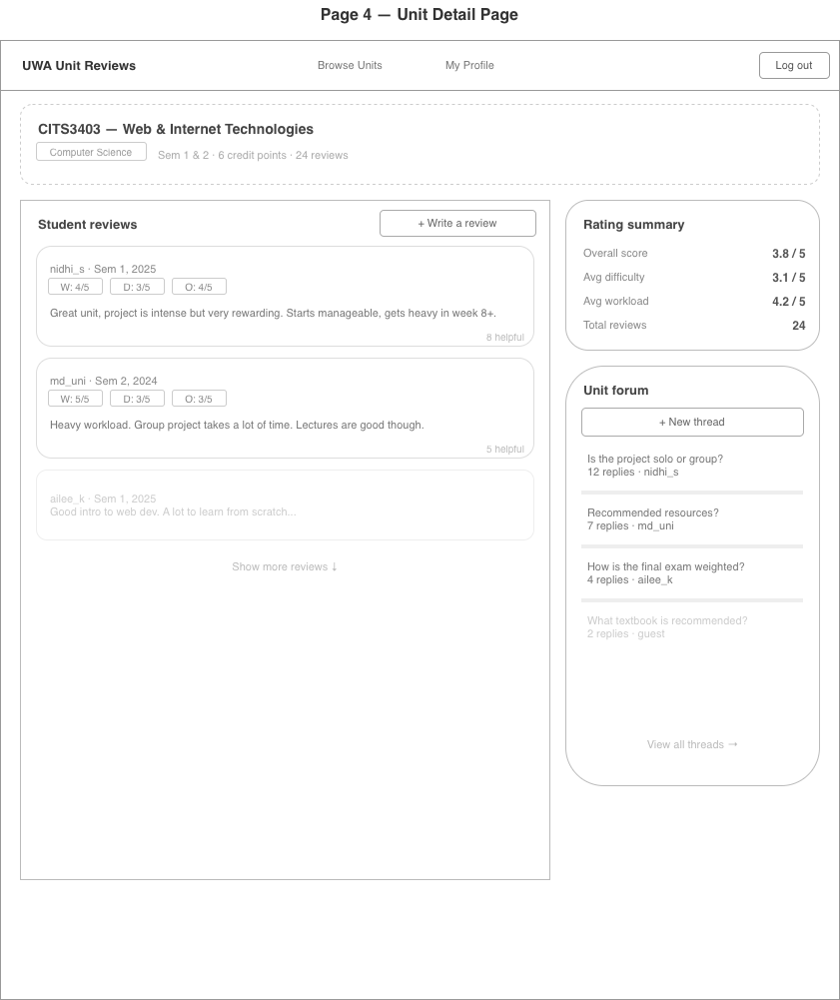
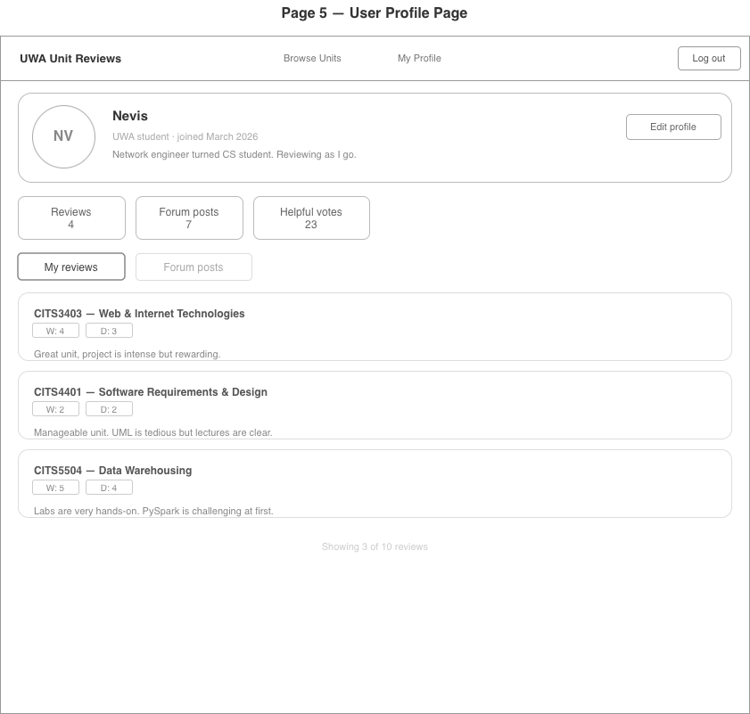
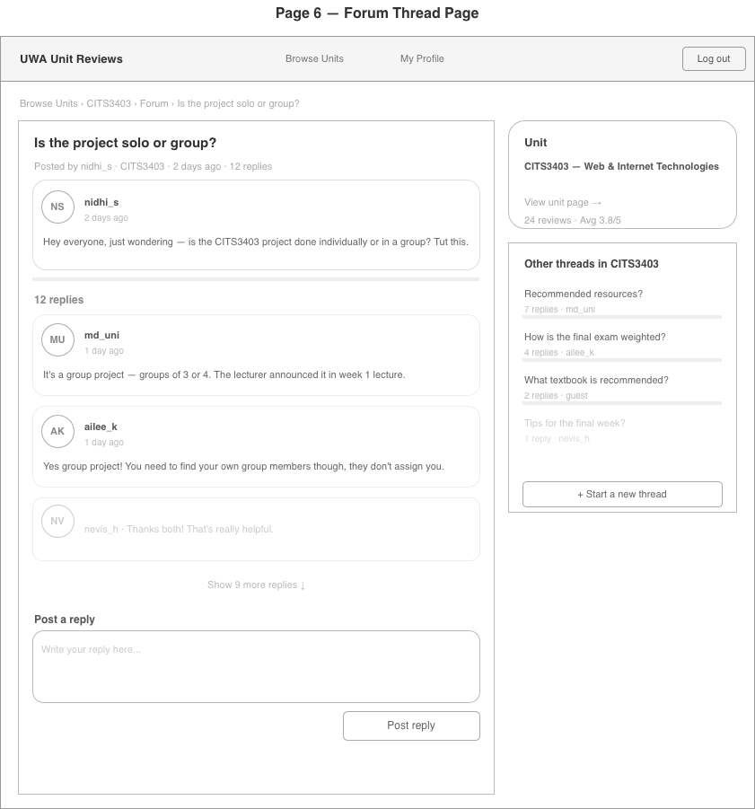

# UWA Unit Reviews — Wireframes

A sketch of the proposed pages for our web application.

---

## Page 1 — Login / Signup

The entry point of the app. Users can log in or create an account. A hero banner introduces the purpose of the site.

---

## Page 2 — Dashboard

The home page after logging in. Shows a welcome message, personal stats, recent community reviews, quick action buttons, and active forum threads.

---

## Page 3 — Units Listing Page

Browse and search all available UWA units. Each unit card shows average difficulty, average workload, and total review count.

---

## Page 4 — Unit Detail Page

Full page for a single unit. Shows all student reviews with ratings, a rating summary panel, and the unit's forum threads.

---

## Page 5 — User Profile Page

A public profile showing the user's bio, stats, and all reviews they have written. Includes a tab to switch between reviews and forum posts.

---

## Page 6 — Forum Thread Page

A dedicated page for a single forum thread tied to a specific unit. The left 
side shows the original post followed by all replies in chronological order, 
each displaying the user's avatar, username, timestamp, and message. A reply 
box at the bottom allows logged-in users to contribute to the discussion. The 
right sidebar shows the unit's basic info and a list of other active threads 
in the same unit, making it easy to navigate between discussions without 
going back to the unit page.

